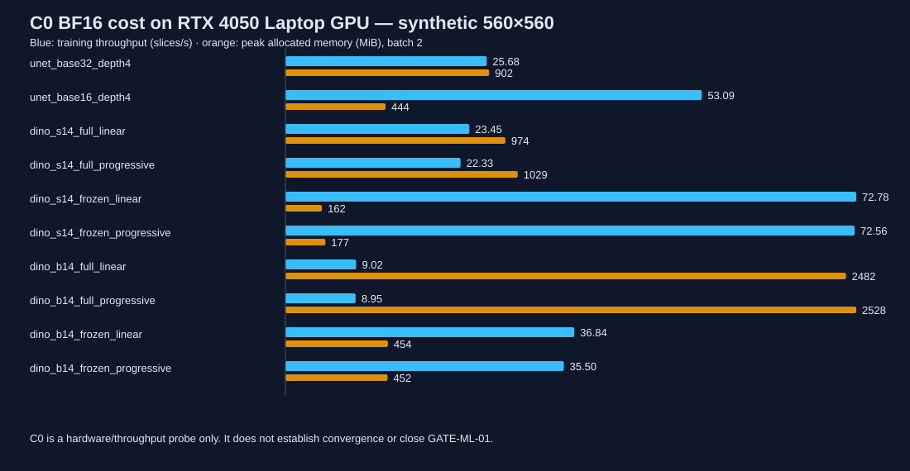

# SPIKE C0 — PRELIMINARY RESULT

**Owner/operator:** Bế Quốc Khánh
**Execution:** 2026-09-16 on the owner's RTX 4050 Laptop GPU
**Status:** `EVIDENCE_READY` — all C0-1…C0-10 have measured or explicitly bounded preliminary evidence; independent review remains required.
**Scope:** synthetic hardware/throughput probe only; **does not close `GATE-ML-01`**.

## Environment and method

- Windows build 26200; Python 3.11.9; PyTorch 2.11.0+cu128; CUDA 12.8; cuDNN 91900; driver 595.79.
- GPU: NVIDIA GeForce RTX 4050 Laptop GPU, 6.0 GiB; host RAM 15.25 GiB; BF16 supported.
- Synthetic `uint8` 640×640×88 volume, DR-011 per-volume p0.5/p99.5 clip and [0,1] scale; slices resized bilinear to 560×560, masks nearest-exact. No cohort-fitted statistic.
- Intended batch 2; 2 warm-up + 10 timed, synchronized steps; data loading excluded. Peak is `torch.cuda.max_memory_allocated`. Each CUDA measurement/search attempt ran in an isolated worker.
- Batch search capped at 16. A result of 16 with `cap` means the true ceiling may be higher.

## Measured configuration cost

| Precision | Variant | Batch | Max fit | Peak MiB | Train slices/s | Output stride |
|---|---|---:|---:|---:|---:|---:|
| fp32 | `unet_base32_depth4` | 2 | 7 | 1488.5 | 14.38 | 1 |
| fp32 | `unet_base16_depth4` | 2 | 15 | 818.5 | 34.36 | 1 |
| fp32 | `dinov2_s14_full_linear` | 2 | 11 | 1337.5 | 8.74 | 14 |
| fp32 | `dinov2_s14_full_progressive` | 2 | 10 | 1455.3 | 7.88 | 1.75 |
| fp32 | `dinov2_s14_frozen_linear` | 2 | 16 (cap) | 179.8 | 32.04 | 14 |
| fp32 | `dinov2_s14_frozen_progressive` | 2 | 16 (cap) | 250.0 | 24.37 | 1.75 |
| fp32 | `dinov2_b14_full_linear` | 2 | 5 | 3138.7 | 3.49 | 14 |
| fp32 | `dinov2_b14_full_progressive` | 2 | 5 | 3234.7 | 3.33 | 1.75 |
| fp32 | `dinov2_b14_frozen_linear` | 2 | 16 (cap) | 493.1 | 12.70 | 14 |
| fp32 | `dinov2_b14_frozen_progressive` | 2 | 16 (cap) | 504.0 | 10.91 | 1.75 |
| bf16 | `unet_base32_depth4` | 2 | 14 | 902.4 | 25.68 | 1 |
| bf16 | `unet_base16_depth4` | 2 | 16 (cap) | 443.7 | 53.09 | 1 |
| bf16 | `dinov2_s14_full_linear` | 2 | 16 (cap) | 974.2 | 23.45 | 14 |
| bf16 | `dinov2_s14_full_progressive` | 2 | 16 (cap) | 1028.8 | 22.33 | 1.75 |
| bf16 | `dinov2_s14_frozen_linear` | 2 | 16 (cap) | 161.6 | 72.78 | 14 |
| bf16 | `dinov2_s14_frozen_progressive` | 2 | 16 (cap) | 177.1 | 72.56 | 1.75 |
| bf16 | `dinov2_b14_full_linear` | 2 | 8 | 2482.3 | 9.02 | 14 |
| bf16 | `dinov2_b14_full_progressive` | 2 | 8 | 2527.9 | 8.95 | 1.75 |
| bf16 | `dinov2_b14_frozen_linear` | 2 | 16 (cap) | 454.0 | 36.84 | 14 |
| bf16 | `dinov2_b14_frozen_progressive` | 2 | 16 (cap) | 452.4 | 35.50 | 1.75 |

At batch 2, BF16 reduced memory and increased throughput for every measured full-training configuration. This is a cost observation, not a final recipe selection. The BF16 DINOv2-S/14 frozen progressive candidate measured 177.1 MiB and 72.56 slices/s; full B/14 progressive measured 2527.9 MiB and 8.95 slices/s.

## Checkpoints and decoder stride

- DINOv2-S/14: `facebook/dinov2-small` at `ed25f3a31f01632728cabb09d1542f84ab7b0056`, weights SHA-256 `ae1e99fcefd534ed978cdeb8326f08030c96e28b7a81ffcbc98a857c84d14be1`.
- DINOv2-B/14: `facebook/dinov2-base` at `f9e44c814b77203eaa57a6bdbbd535f21ede1415`, weights SHA-256 `d73036b56966966d07975d696bde331762f37297e2f095de8cea0040c3aa0841`.
- Linear decoder effective stride 14; progressive decoder 1.75 after three learned ×2 stages; UNet stride 1. Whether these are appropriate for real LA boundaries is C1-5, not measurable in C0.

## Calendar feasibility — C0-7/C0-8

The owner reported approximately **4–5 unattended GPU hours/day** on 2026-09-16. The planning verdict uses **4 h/day** conservatively; 5 h/day is shown as sensitivity, not guaranteed capacity.

Both scenarios assume 80 train cases × 88 slices, 50 epochs, 1.35 overhead, and a matrix of 6 runs + 1 ablation in the 10-day window from 2026-09-21 to 2026-10-01. Epoch count and overhead remain assumptions pending Spike C1.

| BF16 variant | h/run | Matrix h | Days @4h | 4h verdict | Days @5h | 5h verdict |
|---|---:|---:|---:|---|---:|---|
| `unet_base32_depth4` | 5.14 | 35.99 | 9.00 | FITS | 7.20 | FITS |
| `unet_base16_depth4` | 2.49 | 17.40 | 4.35 | FITS | 3.48 | FITS |
| `dinov2_s14_full_linear` | 5.63 | 39.41 | 9.85 | FITS | 7.88 | FITS |
| `dinov2_s14_full_progressive` | 5.91 | 41.38 | 10.34 | DOES NOT FIT | 8.28 | FITS |
| `dinov2_s14_frozen_linear` | 1.81 | 12.70 | 3.17 | FITS | 2.54 | FITS |
| `dinov2_s14_frozen_progressive` | 1.82 | 12.73 | 3.18 | FITS | 2.55 | FITS |
| `dinov2_b14_full_linear` | 14.64 | 102.46 | 25.62 | DOES NOT FIT | 20.49 | DOES NOT FIT |
| `dinov2_b14_full_progressive` | 14.75 | 103.23 | 25.81 | DOES NOT FIT | 20.65 | DOES NOT FIT |
| `dinov2_b14_frozen_linear` | 3.58 | 25.08 | 6.27 | FITS | 5.02 | FITS |
| `dinov2_b14_frozen_progressive` | 3.72 | 26.03 | 6.51 | FITS | 5.21 | FITS |

**Preliminary C0-8 verdict:** 7/10 variants fit the full matrix at the conservative 4 h/day budget (40 GPU hours); 8/10 fit at 5 h/day (50 GPU hours). DINOv2-B/14 full linear and progressive do not fit either scenario. This is not a final recipe choice.

## Acceptance coverage

| Criterion | Result |
|---|---|
| C0-1 compute | PASS — exact host/GPU/framework recorded |
| C0-2 memory | PASS — both families, 10 candidates × 2 precisions |
| C0-3 largest fitting batch | PASS within declared cap 16; capped values are lower bounds |
| C0-4 throughput | PASS — synchronized median, steps/s and slices/s |
| C0-5 decoder stride | PASS — measured/model-reported |
| C0-6 candidate costs | PASS — checkpoint revision/hash, mode, decoder, precision |
| C0-7 per-run extrapolation | PASS (preliminary) — arithmetic and assumptions recorded |
| C0-8 calendar verdict | PASS (preliminary) — conservative 4 h/day plus 5 h/day sensitivity |
| C0-9 DR-011 | PASS — per-volume only plus fixed pretrained constants |
| C0-10 gate statement | PASS — C0 does not close GATE-ML-01 |

**Overall:** 10/10 C0 criteria evidenced; `EVIDENCE_READY`, awaiting independent review. No real dataset, validation, holdout, convergence run, or core matrix run was used.

## Raw evidence

- `spikes/spike_c_ml/EVIDENCE_RAW/c0_probe_20260916T004325+0700.json` — complete FP32 matrix.
- `spikes/spike_c_ml/EVIDENCE_RAW/c0_probe_20260916T005659+0700.json` — complete BF16 matrix.
- `spikes/spike_c_ml/EVIDENCE_RAW/c0_calendar_bf16_4h_20260916.json` — conservative calendar arithmetic.
- `spikes/spike_c_ml/EVIDENCE_RAW/c0_calendar_bf16_5h_20260916.json` — sensitivity arithmetic.
- `spikes/spike_c_ml/harness/probe.py` — measurement harness.
- `spikes/spike_c_ml/harness/extrapolate.py` — calendar arithmetic.

The raw probe logs contain one stale descriptive sentence saying PR #25 was pending review; #25 is merged and QA-002 repair PR #34 leaves the dtype/shape counts used here unchanged. The harness source is corrected for future runs; measured values were not edited after capture.
